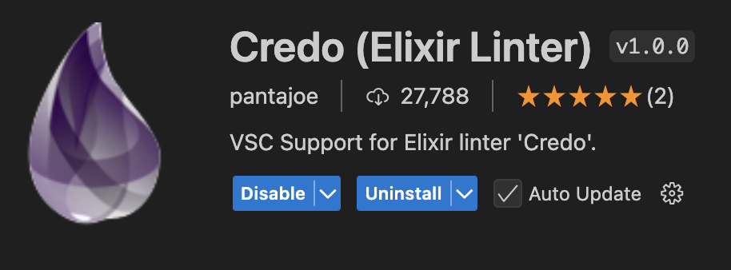
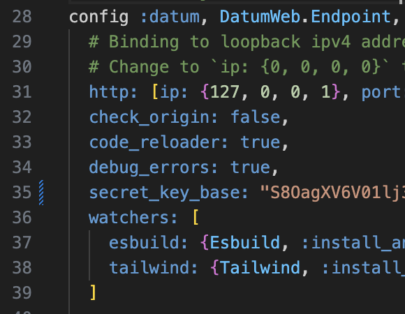

# Ingest

Ingest is desisgned to be the upload point for various data management solutions in the DOE space and beyond. It takes the place of Box and eventually Globus both. With an emphasis on gathering metadata along with the actual data, we hope that this tool becomes a powerhouse for enabling experiments to extract and collect data from various groups and sources more easily than before.

## Requirements
- Elixir 1.16.x
- Erlang OTP 27+
- [asdf](https://asdf-vm.com/) **optional** - used for managing Elixir/Erlang/OTP versions so that you can keep this project separate from your main installations
- [asdf-elixir](https://github.com/asdf-vm/asdf-elixir) and [asdf-erlang](https://github.com/asdf-vm/asdf-erlang) **optional**
- [Mix](https://elixir-lang.org/getting-started/mix-otp/introduction-to-mix.html) - should be installed if you use asdf
- Postgres 14+


## Installation
0. **optional** Navigate to the root of the project and run `asdf install` - this will install all the toolchain and language dependencies needed locally. (In order for VSCode's Elixir plugin to work you must also set the global erlang and elixir versions via `asdf global {erlang/elixir} {latest/version in .tool-versions}`)
1. Run `mix deps.get` & `mix deps.compile`
2. Install the `phx_new` generator - `mix archive.install hex phx_new`
3. `mix setup`
4. Run `mix phx.gen.secret` and copy the output to line 27 in your `config/dev.exs` file - under `secret_key_base`
5. If you're on VSCode you can use the default run configuration to run your application from the editor, or you may start your server by running `mix phx.server` in either your terminal or an iEX instance

### VSCode Extensions

Visual Studio Code with a few extensions is primarily recommended as the editor of choice for Elixir/Phoenix. Extensions are available through the extensions tab on the left column of VS Code and typed into the search bar. These extensions help with linting and coding hints to ease the development experience. **Note**: Users of IntelliJ should be aware that there is no support for Phx HEEx templates and that it is recommended to use VSC or at least Zed or Neovim instead.

- Credo: a static code analysis tool providing code annotations which include best practices and warnings or errors before being compiled to the BEAM. The main extension is by pantajoe. 
- Lexical: the base for the new language server that the Elixir team is funding. 
- Phoenix Framework extension: recommended for the web application. 

## Working Under Enterprise CA (Dealing with Cert Errors)

You will need to add a file for rebar3. If it does not already exist, create the directory ~/.config/rebar3. Then create the file `rebar.config` with the following text modified for the path to your cert.

`{ssl_cacerts_path, ["/path/to/YOUR_COMPANY_CERT"]}.`

### Modifying Environment Variables

Hex uses an environment variable called `HEX_CACERTS_PATH` set to your certificate bundle. This will resemble the following:

```sh
export HEX_CACERTS_PATH=/path/to/YOUR_COMPANY_CERT.crt
```

and be added to a .bash_profile or preferred environment variable configuration. Failure to do this will result in an SSL error.

After adding this variable to your profile, be sure to either close and reopen your terminal, or run `source ~/.bash_profile` (replacing bash_profile with your preferred env config file) to load the environment variable into your current terminal.

### Modifying `mix.esx`

Uncomment the top line in the `mix.exs` file and change the path to reflect the path to your cert. 

### Modifying `config/config.exs`

You also need to modify the configuration file in `config/config.exs`, adding `cacerts_path: "/path/to/YOUR_COMPANY_CERT"` to the following lines like so: 

### Modifying `config/dev.exs`

You will also need to update your `secret_key_base` environment variable. To generate a new secret, type `mix phx.gen.secret` at the command line. Paste the resulting output into `secret_key_base` in `dev.exs` (full image cropped for security reasons):




## Common Problems and Solutions
- Mix can't find `rebar3` or fails to install `rebar3` via Hex: Download the [rebar3 binary](https://rebar3.org/) for your OS and put in a common location (`/usr/local/bin` for Unix systems). Then use this command to point Hex to `rebar3` - `mix local.rebar rebar3 path/to/rebar`
- CA Cert problems: Typically you'll see a failed `:httpc` library call and something about an unkown CA authority. The easier solution is to include an environment variable called `HEX_CACERTS_PATH` and set it to your root CA bundle. Another, less secure option, is to set `HEX_UNSAFE_HTTPS` to `1` and turn off SSL completely. Not recommended  
- More CA Cert Problems - modify the configuration file in `config/dev.exs` - you will see various places referring to your SSL cert store (default /etc/ssl/certs on Unix systems) - change those to point to your certificate bundle
- ElixirLS Problems - Two different solutions. Either make sure you are opening the project from the server directory or install hex globally. `mix archive.install github hexpm/hex branch latest` run this command in `/users/{YourName}` and `/Ingest/` directory.  
- If you are getting an error with Argon2 running `mix setup`, make sure you do not have a space in the folder names (even the parent folders of the git repo)

## Editor Setup
We recommend that you use either VSCode or Neovim for Elixir. 
[Setup for VSCode](https://fly.io/phoenix-files/setup-vscode-for-elixir-development/) (Make sure you also install the Credo extension)
[Setup for NeoVim](https://elixirforum.com/t/neovim-elixir-setup-configuration-from-scratch-guide/46310)

## Running
To start your Phoenix server:

  * Run `mix setup` to install and setup dependencies
  * Start Phoenix endpoint with `mix phx.server` or inside IEx with `iex -S mix phx.server`

Now you can visit [`localhost:4000`](http://localhost:4000) from your browser.

Ready to run in production? Please [check our deployment guides](https://hexdocs.pm/phoenix/deployment.html).

## Learn more

  * Official website: https://www.phoenixframework.org/
  * Guides: https://hexdocs.pm/phoenix/overview.html
  * Docs: https://hexdocs.pm/phoenix
  * Forum: https://elixirforum.com/c/phoenix-forum
  * Source: https://github.com/phoenixframework/phoenix
